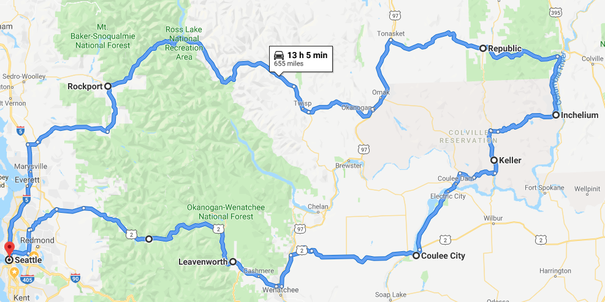
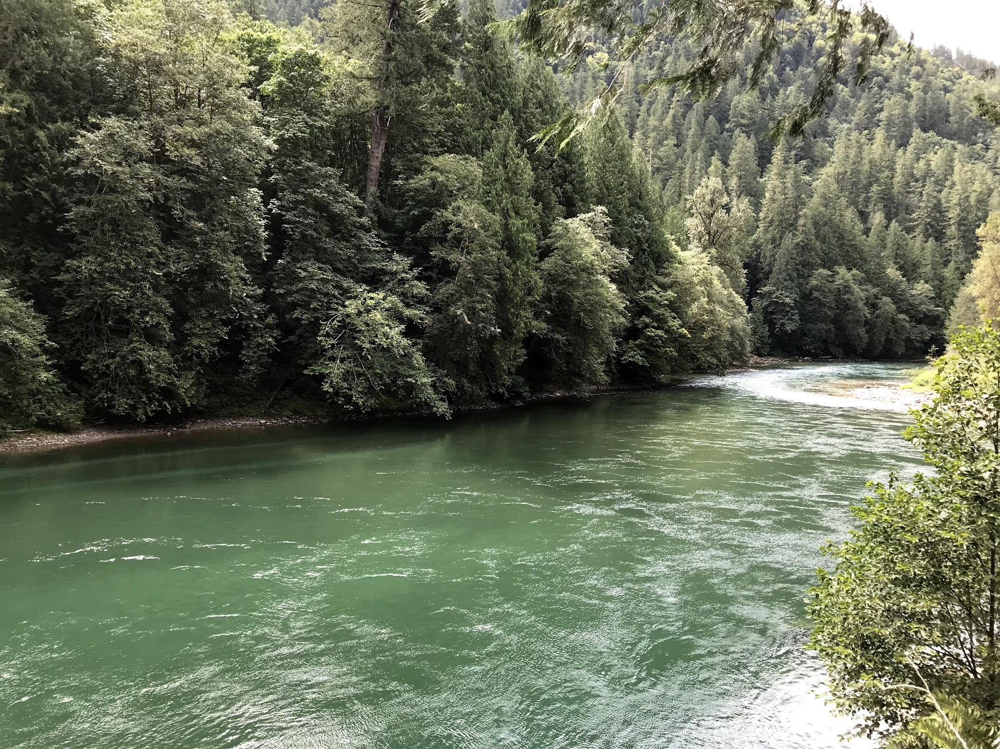
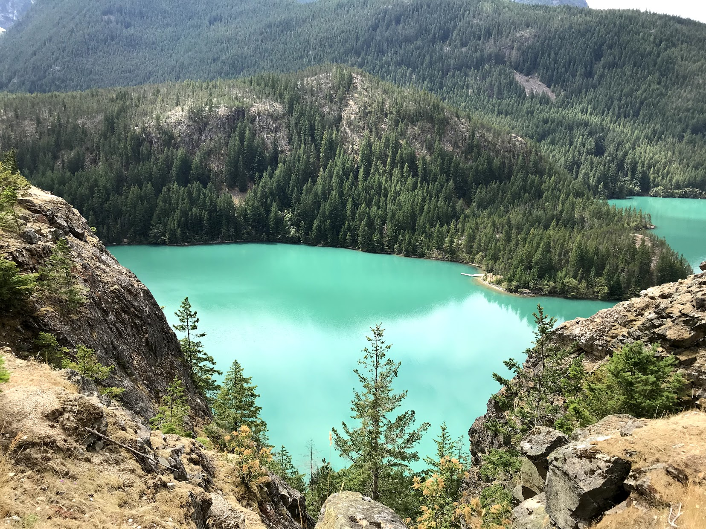
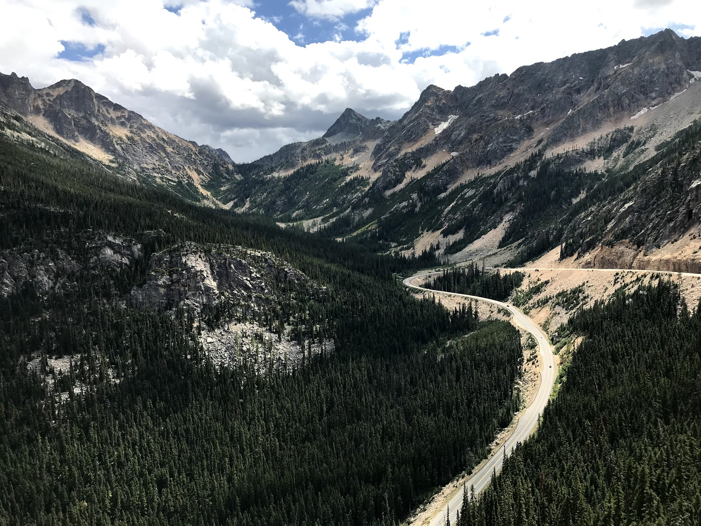
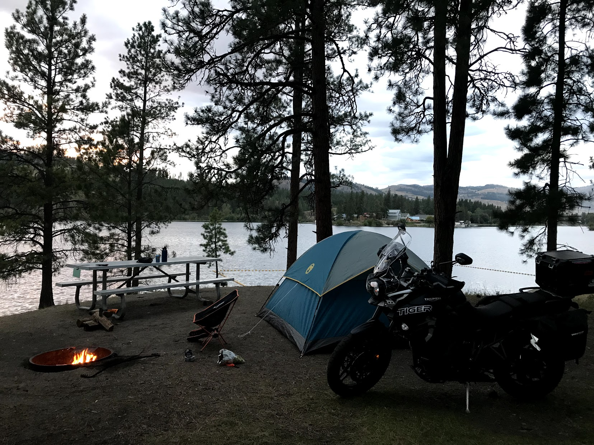
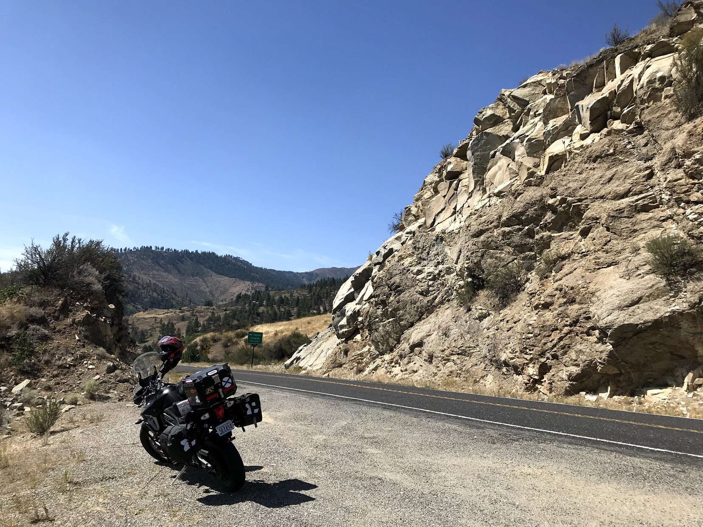
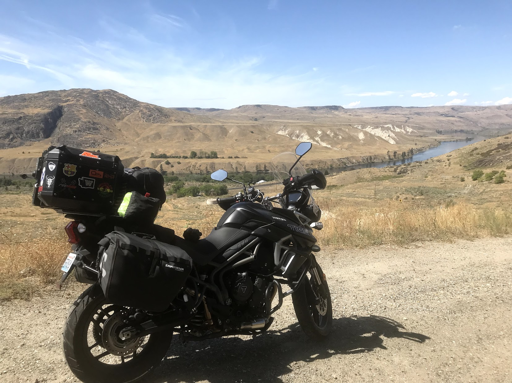
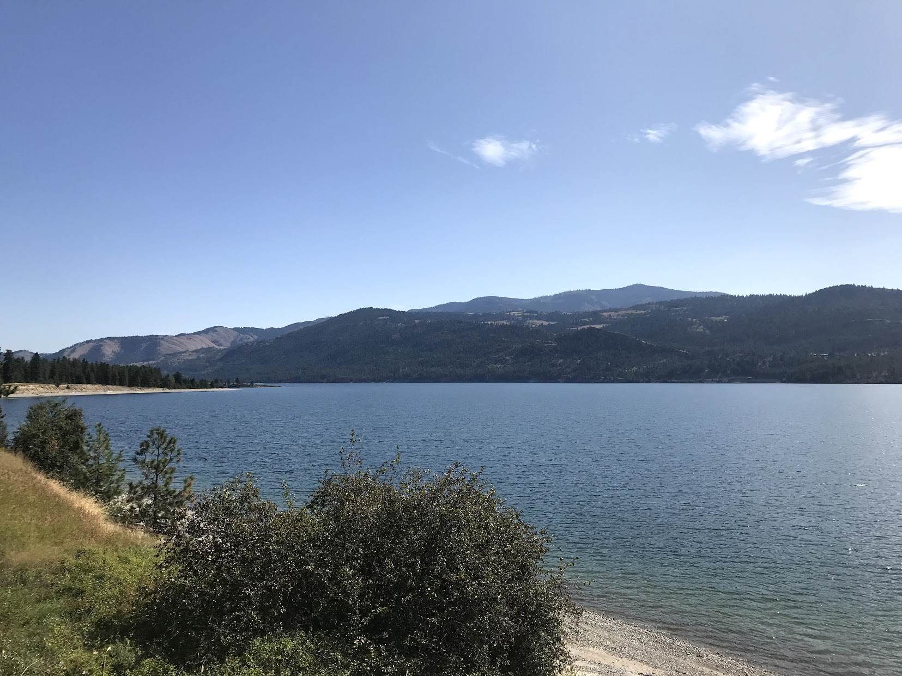
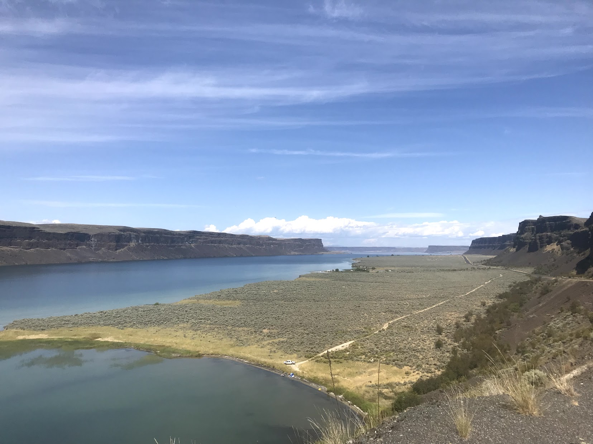
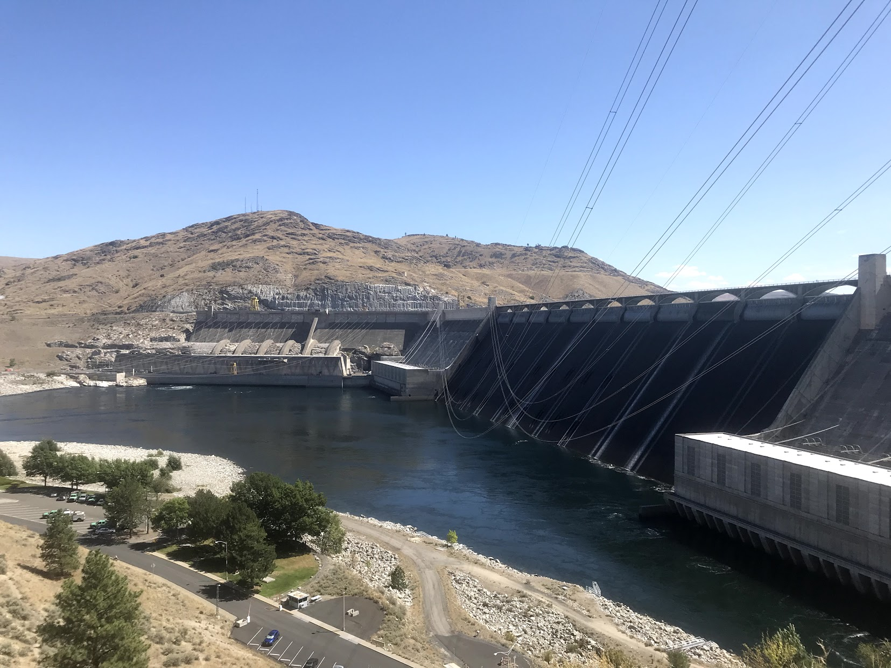

In August, I went on a short 2-day road trip around Eastern Washington. Lots of on and oof road rides with gorgeous views.

Took hwy 20 East which is famous in Washington for its views and twisties.

A river along hwy 20 near Rockport, WA

View of Diablo Lake from a vista point near by

Mountains! What else can you say?

My camping spot on lake Curlew

Day 2 was full of twisted roads and mountain passes :)

