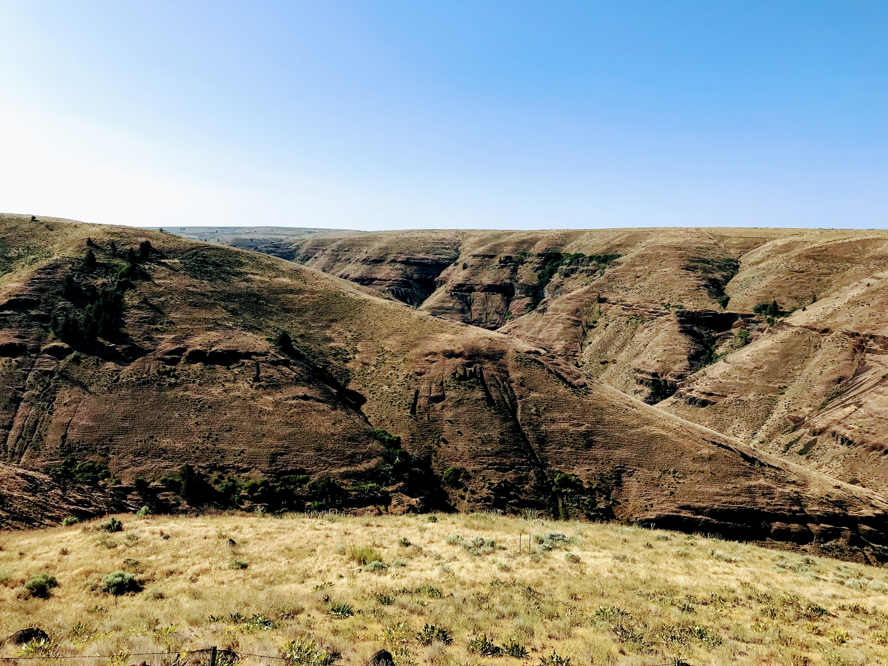
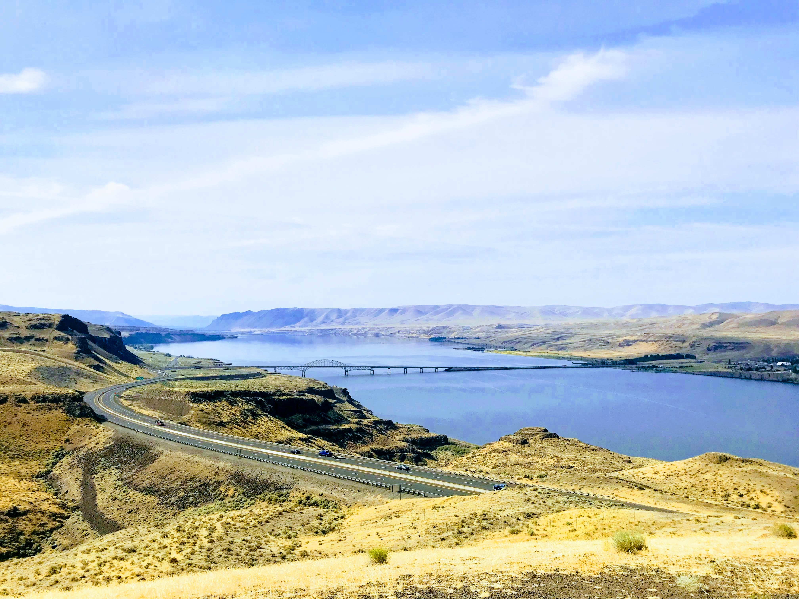

This summer I was fortunate enough to be able to take a few days off and ride through the southern parts of WA into Oregon, head east from there before turning north and coming back up to Washington state. The weather stayed dry and sunny for the whole trip and temperatures hovered at around 80 degrees F.

The roads through the Mt. Rainier National Park and Glifford Pinchot National Forest were super scenic with plenty of good twists and elevetion gain.

Later in the afternoon I got to Columbia river on the border between Washington and Oregon. The views were truly astonishing. From there I headed east and then south to Grass Valley, OR where I spent the first night.

Grass Valley is a tiny town with a population around 150 people. It's located 120 miles east of Portland.

The next day was definitely the highlight of the whole trip. The riding in that area is amazing, roads were clear and twisty, traffic was close to none. It probably helped that I was there on a week day. The road from Grass Valley to Tygh Valley was outstanding with plenty of spots to pull over and enjoy the scenery.

But the part that really stood out was a Shaniko - Antelope - Fossil ride. Even if I went straight back home right after; it'd be worth it!

I crossed back up to Washington before spending the night in Kennewick. Next day was a long ride back home through the mostly familiar areas :)
I did get a good shot of Columbia river again before turning west on hwy2.

