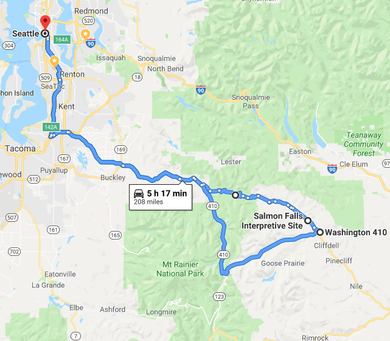
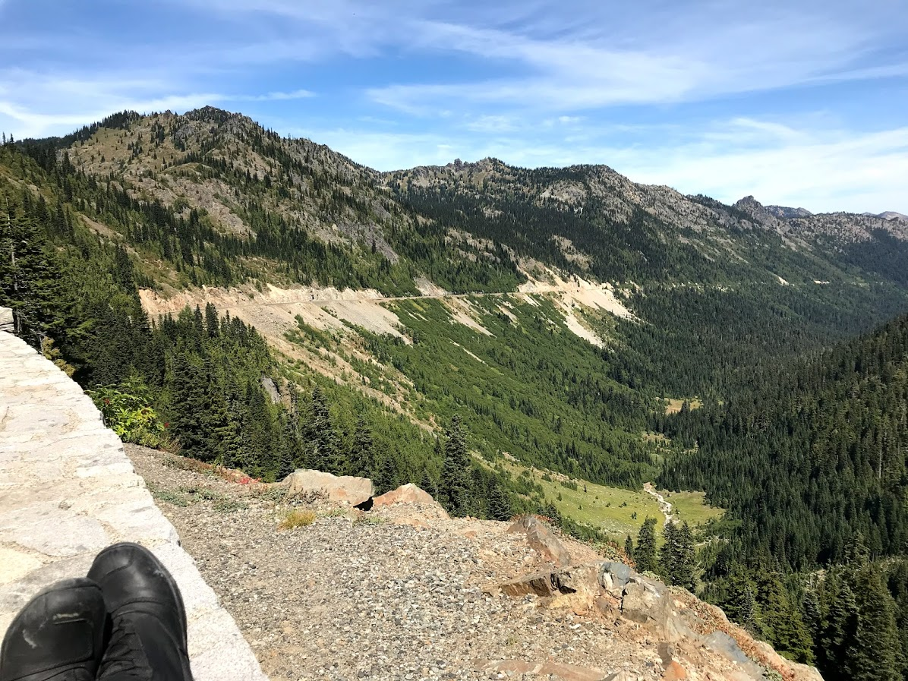

Took a day trip to Mt. Rainier National Park more specifically Naches Pass on hwy 410.

On the way there decided to venture off the familiar Chinook Pass Hwy onto NF-70 which turned to gravel in a few miles - had tons of fun on my adv bike. Took just over 1 hour to get back onto Hwy 410 but it was totally worth it!

View from Naches Pass on the way back home.

